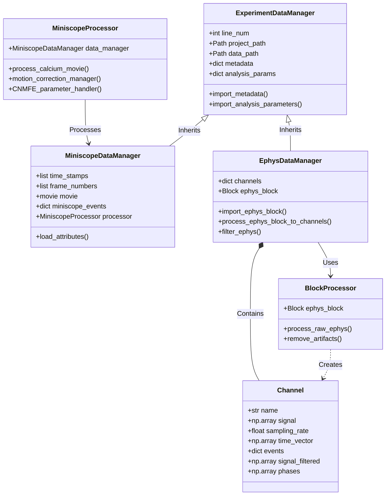

# ACE-neuro: Analysis of Calcium Imaging and Ephys

**A comprehensive, open-source data analysis pipeline for systems neuroscience.**

This software facilitates the processing, analysis, and visualization of simultaneous calcium imaging (Miniscope) and electrophysiology (EEG/LFP) data. It provides a modular and extensible framework for handling complex multimodal datasets, as described in **[Paper Title/Citation Placeholder]**.

## Key Features

*   **Miniscope Processing:** End-to-end pipeline for 1-photon calcium imaging data, incorporating:
    *   Preprocessing: Cropping, detrending, and $\Delta F/F$ normalization.
    *   Motion Correction: Rigid and non-rigid registration.
    *   Source Extraction: Implementation of Constrained Nonnegative Matrix Factorization for micro-Endoscopic data (CNMF-E).
    *   Event Detection: Robust inference of calcium events from temporal traces.
*   **Electrophysiology Analysis:** Tools for importing and cleaning Neuralynx data, including artifact removal, filtering, phase computation, and spectral analysis.
*   **Multimodal Integration:** Seamless alignment of independent Miniscope and Ephys timestamps, enabling cross-modal analysis such as phase-locking of calcium events to channel-specific oscillations.
*   **Data Management:** Integrated utilities for managing large experiment cohorts with explicit path management and automated cloud storage (Box) interaction.
*   **Modern Infrastructure:** 100% type-hinted codebase, automated documentation site, and CI/CD testing framework.

## System Architecture

The project is built on a robust object-oriented framework designed for scalability and reproducibility:



### Core Data Classes
*   **`ExperimentDataManager`**: Base class for managing experiment metadata and analysis parameters.
*   **`MiniscopeDataManager`**: Specialized handler for calcium imaging data, managing video streams, timestamps, and CNMF-E results.
*   **`EphysDataManager`**: Specialized handler for electrophysiology data, managing raw Block imports and channel signal processing.

### Processing Classes
*   **`MiniscopeProcessor`**: Orchestrates the calcium imaging workflow, wrapping `CaImAn` functionality with optimized defaults and parallel processing management.
*   **`BlockProcessor`**: Handles signal conditioning and artifact removal for electrophysiological data.

## Installation

1. **Prerequisites**: Python 3.10+, Mamba/Conda.
2. **Clone & Install**:
   ```bash
   git clone https://github.com/emelon8/experiment_analysis.git
   cd experiment_analysis
   mamba env create -f linux_environment.yml && conda activate caiman
   pip install -e .
   ```
   CaImAn is provided by the conda env above. For a **pip-only** setup, use `pip install -e ".[caiman]"` if your index provides CaImAn; otherwise install CaImAn from [conda-forge](https://anaconda.org/conda-forge/caiman) or the [CaImAn repo](https://github.com/flatironinstitute/CaImAn) and then `pip install -e .`.
3. **Configure Paths**: Use `--project-path` CLI arguments or pass paths to `Pipeline.run()` (see below).

### Project Setup

The pipeline requires explicit paths — no hidden environment variables or config files:

1.  **CLI Arguments**: Use `--project-path` and `--data-path` when running scripts.
2.  **Programmatic API**: Pass paths directly to the `Pipeline.run()` method.

```python
from ace_neuro.pipelines.ephys import EphysPipeline

api = EphysPipeline()
api.run(line_num=96, project_path="/path/to/project")
```

For more details on directory structure and cloud integration, see the **[Getting Started guide on Read the Docs](https://ace-neuro.readthedocs.io/en/latest/getting_started/)** (source: [`docs/getting_started.md`](docs/getting_started.md)).

## Usage

The project uses modular pipeline scripts as the primary entry points. Each pipeline loads parameters from your project's `analysis_parameters.csv` based on the experiment's line number.

### 1. Miniscope Analysis
**Entry point:** `python -m ace_neuro.pipelines.miniscope` (implementation under `src/ace_neuro/pipelines/miniscope.py`).

```bash
# Run analysis for experiment line 96
python -m ace_neuro.pipelines.miniscope --line-num 96

# Run in headless mode (e.g., for HPC/Slurm jobs)
python -m ace_neuro.pipelines.miniscope --line-num 96 --headless
```

### 2. Electrophysiology Analysis
**Entry point:** `python -m ace_neuro.pipelines.ephys` (implementation under `src/ace_neuro/pipelines/ephys.py`).

```bash
python -m ace_neuro.pipelines.ephys --line-num 96
```

### 3. Multimodal Analysis
**Entry point:** `python -m ace_neuro.pipelines.multimodal` (implementation under `src/ace_neuro/pipelines/multimodal.py`).

```bash
python -m ace_neuro.pipelines.multimodal --line-num 97
```

For detailed documentation, see the user guides: [Miniscope](docs/guides/miniscope.md), [Ephys](docs/guides/ephys.md), and [Multimodal](docs/guides/multimodal.md) (also published on [Read the Docs](https://ace-neuro.readthedocs.io/en/latest/)).

## Documentation

A comprehensive documentation site, including full API references and guides, is available at:
**[https://ace-neuro.readthedocs.io/en/latest/](https://ace-neuro.readthedocs.io/en/latest/)**

To view the documentation locally:
```bash
pip install mkdocs-material mkdocstrings-python
mkdocs serve
```

## Examples

Check the `examples/` directory for demonstration scripts:
*   **[explicit_paths_demo.py](examples/explicit_paths_demo.py)**: Shows how to run pipelines using the explicit path API.

## Development and testing

### Test fixtures

- **`tests/data/sample_recording/`** — Small committed recordings used by **autodetect** tests (`MiniscopeDataManager.create` / `EphysDataManager.create` routing) and by the **slow** Miniscope CNMF-E end-to-end test. A normal clone includes this tree; do not remove it if you want those tests to run.
- **Regenerating fixtures** — If you have the full raw `sample data/` folders at the project root (not required for most contributors), run [`scripts/create_test_data.py`](scripts/create_test_data.py) to rebuild truncated UCLA miniscope + Neuralynx ephys fixtures from those sources.

### Running tests

```bash
pip install -e ".[dev]"
# Default: fast tests (excludes slow CNMF-E full pipeline)
pytest tests/ -m "not slow"
# Full suite including Miniscope CNMF-E e2e on sample data
pytest tests/
```

You can configure CI (e.g. GitHub Actions) to run `pytest tests/ -m "not slow"` on every push or PR; add a separate job or manual workflow if you want the full **slow** Miniscope CNMF-E suite on release branches.

## License

**TODO:** Final license terms are pending discussion with lab leadership. Do not assume a specific license until this section and the packaging metadata in `pyproject.toml` are updated and a `LICENSE` file is added.
