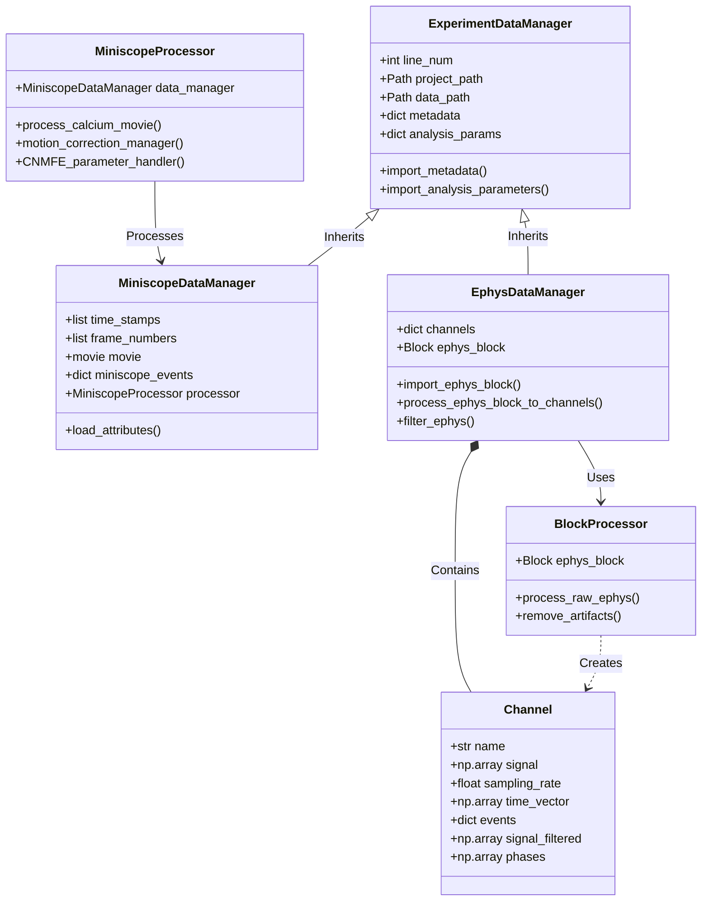

# ACE-neuro: Analysis of Calcium Imaging and Ephys

**A comprehensive, open-source data analysis pipeline for systems neuroscience.**

This software facilitates the processing, analysis, and visualization of simultaneous calcium imaging (Miniscope) and electrophysiology (EEG/LFP) data. It provides a modular and extensible framework for handling complex multimodal datasets, as described in **[Paper Title/Citation Placeholder]**.

## Key Features

*   **Miniscope Processing:** End-to-end pipeline for 1-photon calcium imaging data, incorporating:
    *   Preprocessing: Cropping, detrending, and $\Delta F/F$ normalization.
    *   Motion Correction: Rigid and non-rigid registration.
    *   Source Extraction: Implementation of Constrained Nonnegative Matrix Factorization for micro-Endoscopic data (CNMF-E).
    *   Event Detection: Robust inference of calcium events from temporal traces.
*   **Electrophysiology Analysis:** Tools for importing and cleaning Neuralynx data, including artifact removal, filtering, phase computation, and spectral analysis.
*   **Multimodal Integration:** Seamless alignment of independent Miniscope and Ephys timestamps, enabling cross-modal analysis such as phase-locking of calcium events to channel-specific oscillations.
*   **Data Management:** Integrated utilities for managing large experiment cohorts with explicit path management and automated cloud storage (Box) interaction.
*   **Modern Infrastructure:** 100% type-hinted codebase, automated documentation site, and CI/CD testing framework.

## System Architecture

The project is built on a robust object-oriented framework designed for scalability and reproducibility:



### Core Data Classes
*   **`ExperimentDataManager`**: Base class for managing experiment metadata and analysis parameters.
*   **`MiniscopeDataManager`**: Specialized handler for calcium imaging data, managing video streams, timestamps, and CNMF-E results.
*   **`EphysDataManager`**: Specialized handler for electrophysiology data, managing raw Block imports and channel signal processing.

### Processing Classes
*   **`MiniscopeProcessor`**: Orchestrates the calcium imaging workflow, wrapping `CaImAn` functionality with optimized defaults and parallel processing management.
*   **`BlockProcessor`**: Handles signal conditioning and artifact removal for electrophysiological data.

## Installation

1. **Prerequisites**: Python 3.10+, Mamba/Conda.
2. **Clone & Install**:
   ```bash
   git clone https://github.com/emelon8/experiment_analysis.git
   cd experiment_analysis
   mamba env create -f linux_environment.yml && conda activate caiman
   pip install -e .
   ```
3. **Configure Paths**: Use `--project-path` CLI arguments or pass paths to `Pipeline.run()` (see below).

### Project Setup

The pipeline requires explicit paths — no hidden environment variables or config files:

1.  **CLI Arguments**: Use `--project-path` and `--data-path` when running scripts.
2.  **Programmatic API**: Pass paths directly to the `Pipeline.run()` method.

```python
from ace_neuro.pipelines.ephys import EphysPipeline

api = EphysPipeline()
api.run(line_num=96, project_path="/path/to/project")
```

For more details on directory structure and cloud integration, see the **[Getting Started Guide](GETTING_STARTED.md)**.

## Usage

The project uses modular pipeline scripts as the primary entry points. Each pipeline loads parameters from your project's `analysis_parameters.csv` based on the experiment's line number.

### 1. Miniscope Analysis
**Script:** `ace_neuro/miniscope/miniscope_pipeline.py`

```bash
# Run analysis for experiment line 96
python -m ace_neuro.pipelines.miniscope --line-num 96

# Run in headless mode (e.g., for HPC/Slurm jobs)
python -m ace_neuro.pipelines.miniscope --line-num 96 --headless
```

### 2. Electrophysiology Analysis
**Script:** `ace_neuro/ephys/ephys_pipeline.py`

```bash
python -m ace_neuro.pipelines.ephys --line-num 96
```

### 3. Multimodal Analysis
**Script:** `ace_neuro/multimodal/multimodal_pipeline.py`

```bash
python -m ace_neuro.pipelines.multimodal --line-num 97
```

For detailed documentation, see the module-specific READMEs in `ace_neuro/miniscope/README.md`, `ace_neuro/ephys/README.md`, and `ace_neuro/multimodal/README.md`.

## Documentation

A comprehensive documentation site, including full API references and guides, is available at:
**[Link to your GitHub Pages site - e.g., https://emelon8.github.io/experiment_analysis/]**

To view the documentation locally:
```bash
pip install mkdocs-material mkdocstrings-python
mkdocs serve
```

## Examples

Check the `examples/` directory for demonstration scripts:
*   **[explicit_paths_demo.py](examples/explicit_paths_demo.py)**: Shows how to run pipelines using the explicit path API.

## License

This project is licensed under the GNU General Public License v2.0 (or later) - see the LICENSE file for details.
