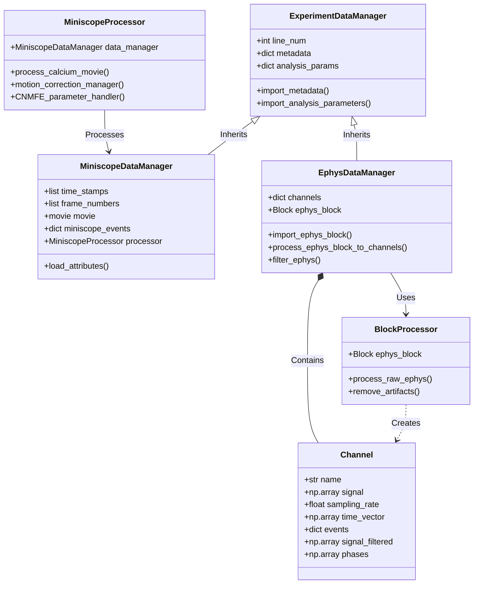

# Experiment-Analysis

**A comprehensive data analysis pipeline for the Melonakos Lab of Neuroscience at Brigham Young University.**

This software facilitates the processing, analysis, and visualization of simultaneous calcium imaging (Miniscope) and electrophysiology (EEG/LFP) data from rodent experiments. It provides a modular and extensible framework for handling complex multimodal neuroscience datasets.

## Key Features

*   **Miniscope Analysis:** Full pipeline for Calcium Imaging data including preprocessing (cropping, detrending, $\Delta F/F$), motion correction, source extraction (CNMF-E), and event detection.
*   **Electrophysiology Analysis:** Tools for importing Neuralynx data, artifact removal, filtering, phase computation, and spectrogram generation.
*   **Multimodal Integration:** Seamless alignment of Miniscope and Ephys timestamps, enabling cross-modal analysis like phase-locking of calcium events to EEG oscillations.
*   **Automated Data Management:** Integrated tools for downloading large datasets from Box and managing experiment metadata.

## System Architecture

The project is built on a robust set of classes designed to handle specific data streams and processing tasks:

### Core Data Classes
*   **`ExperimentDataManager`** (Base): Manages the import and storage of experiment metadata from `experiments.csv` and analysis parameters from `analysis_params.csv`.
*   **`MiniscopeDataManager`**: Inherits from `ExperimentDataManager`. specialized for Miniscope data. It handles movie files, timestamps, frame numbers, and stores intermediate processing results (e.g., motion-corrected movies, CNMFE estimates).
*   **`EphysDataManager`**: Inherits from `ExperimentDataManager`. Specialized for raw Neuralynx data. It uses `BlockProcessor` to convert raw Neo blocks into manageable `Channel` objects.
*   **`Channel`**: A data object representing a single electrophysiology channel (e.g., PFC, EEG). Stores raw signal, filtered signal, sampling rate, and time vector.

### Processing Classes
*   **`MiniscopeProcessor`**: Orchestrates the Miniscope processing pipeline, including parallel setup, motion correction, parameter optimization, and CNMFE execution.
*   **`BlockProcessor`**: Processes raw electrophysiology blocks into individual channels, handling artifact removal and signal cleaning.

### System Diagram



## Getting Started

### Prerequisites
*   **Python Environment:** We highly encourage the use of **miniforge3** to avoid dependency conflicts with packages like `CaImAn` and `liblapack`.

### Installation

1.  **Clone the Repository:**
    ```bash
    git clone https://github.com/emelon8/experiment_analysis.git
    cd experiment_analysis
    ```

2.  **Install Dependencies:**
    Using `miniforge3` or `mamba`, install the required packages:
    *   `CaImAn`
    *   `FreeSimpleGui`
    *   `Neo`
    *   (See `environment.yml` for a full list if available)

3.  **Install the Package:**
    ```bash
    pip install -e .
    ```

### Data Setup

Experimental data (EEG, Calcium imaging) is typically stored in the lab's Box account. You must download the relevant files to your local machine.

1.  **Configure Experiments:**
    Ensure `data/experiments.csv` reflects your local file paths (this shouldn't be a concern if you use the automated download scripts as relative pathing is used by default). The `line_num` used in scripts corresponds to a row in this CSV.

2.  **Download Data:**
    *   **Automated Download (Recommended):**
        1.  Copy `src2/shared/BLANK_box_credentials.py` to `src2/shared/box_credentials.py` and follow the instructions within to configure your Box authentication.
        2. Upon running your desired API script, your chosen files will be automatically downloaded and processed.
    *   **Manual Download:**
        Download the necessary folders from Box. Update the base file paths in paths.py to reflect the location of downloaded files.  

## Usage

The project uses "API" scripts as the primary entry points for analysis. These scripts allow you to configure parameters and run complete workflows.

### 1. Miniscope Analysis
**Script:** `src2/miniscope/miniscope_api.py`

This script runs the complete calcium imaging pipeline.
*   Open the file and scroll to the `if __name__ == "__main__":` block.
*   Set the `line_num` to the experiment you wish to analyze.
*   Configure flags for steps you want to run (e.g., `crop`, `run_CNMFE`, `compute_miniscope_spectrogram`).
*   Run the script:
    ```bash
    # Option A: Standard Run (Backwards Compatible)
    # Uses the parameters hardcoded in the script's __main__ block
    python src2/miniscope/miniscope_api.py

    # Option B: Config File (Recommended)
    # Uses a YAML file to define parameters
    python src2/miniscope/miniscope_api.py --config experiment_template.yaml

    # Option C: Headless / Slurm
    # Bypasses all GUI steps (cropping, inspection) for remote execution
    python src2/miniscope/miniscope_api.py --config experiment_template.yaml --headless
    ```

### 2. Electrophysiology Analysis
**Script:** `src2/ephys/ephys_api.py`

This script handles loading, filtering, and visualizing EEG/LFP data.
*   Open the file and configure the `__main__` block.
*   Set `line_num` and `channel_name`.
*   Enable visualization flags like `plot_spectrogram` or `plot_channel`.
*   Run the script:
    ```bash
    # Option A: Standard Run
    python src2/ephys/ephys_api.py

    # Option B: Config File (Recommended)
    python src2/ephys/ephys_api.py --config experiment_template.yaml

    # Option C: Headless / Slurm
    python src2/ephys/ephys_api.py --config experiment_template.yaml --headless
    ```

### 3. Multimodal Analysis
**Script:** `src2/multimodal/multimodal_api.py`

This script integrates both modalities, performing alignment and cross-modal analysis.
*   It internally calls `EphysAPI` and `MiniscopeAPI`.
*   It computes advanced metrics like the phase of EEG oscillations during calcium events.
*   Run the script:
    ```bash
    # Option A: Standard Run
    python src2/multimodal/multimodal_api.py

    # Option B: Config File (Recommended)
    # Uses 'experiment', 'miniscope_*', 'ephys', and 'multimodal' sections from config
    python src2/multimodal/multimodal_api.py --config experiment_template.yaml

    # Option C: Headless / Slurm
    python src2/multimodal/multimodal_api.py --config experiment_template.yaml --headless
    ```

## API Outputs & Analysis Guide

For detailed information on the outputs and analysis recommendations for each API, please refer to the README files in their respective directories:

*   **[Miniscope Analysis Guide](src2/miniscope/README.md)**: Details on `estimates.hdf5` and the component selection GUI.
*   **[Ephys Analysis Guide](src2/ephys/README.md)**: Information on channel plots, spectrograms, and phase analysis.
*   **[Multimodal Analysis Guide](src2/multimodal/README.md)**: Instructions for interpreting phase-locking histograms and aligned data.

## Authors

*   Eric Melonakos
*   Luke Richards

## License

No license specified.
