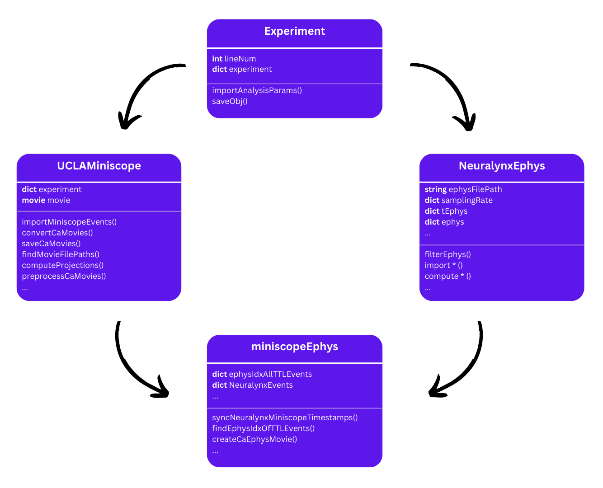

# ACE-neuro: Analysis of Calcium Imaging and Ephys

<p align="center">
  
</p>

**ACE-neuro** (Analysis of Calcium Imaging and Ephys) is an integrated, object-oriented Python library designed for the systems neuroscience community. It provides high-level pipelines for processing simultaneous 1-photon calcium imaging (Miniscope) and multi-channel electrophysiology (EEG/LFP) data.

---

<div class="grid cards" markdown>

-   __Unified Search__
    
    Full integrated search functionality across all pipelines, guides, and API references.

-   __Multimodal Alignment__
    
    Seamlessly align miniscope movies with ephys timestamps using TTL pulses for cross-modal analysis.

-   __CNMF-E Integrated__
    
    Native wrappers around [CaImAn](https://github.com/flatironinstitute/CaImAn) for optimized source extraction in micro-endoscopic data.

-   __HPC Ready__
    
    Headless mode and Slurm support built-in for high-throughput batch processing on supercomputers.

</div>

---

## Step-by-step tutorials

These notebooks explain **`project_path`** (folder with **`experiments.csv`** and **`analysis_parameters.csv`**) vs **`data_path`** (raw recordings), then walk each pipeline stage by stage:

- [Miniscope](notebooks/miniscope_pipeline_tutorial.ipynb)
- [Ephys](notebooks/ephys_pipeline_tutorial.ipynb)
- [Multimodal alignment](notebooks/multimodal_alignment_tutorial.ipynb)
---

## Installation

Install ACE-neuro and its core dependencies in your environment:

```bash
# Clone and install in editable mode
git clone https://github.com/emelon8/experiment_analysis.git
cd experiment_analysis
pip install -e "."
```

---

## API Overview

ACE-neuro provides a clear, modular API optimized for both interactive use and automated scripts.

```python
from ace_neuro.pipelines.multimodal import MultimodalPipeline

# Initialize and run a synchronized analysis
api = MultimodalPipeline()
api.run(
    line_num=97,
    project_path="/path/to/project",
    data_path="/path/to/raw_data",
    headless=True  # Run without GUIs for batch processing
)
```

**Parameters:** every pipeline exposes a `run(...)` method whose arguments are **keyword-only in practice** (see docstrings). You set them via **Python kwargs**, optional **`analysis_parameters.csv`** (loaded with `load_analysis_params`), and **CLI defaults** for `python -m ace_neuro.pipelines.*`. The precedence and full pattern are spelled out under **§3a. Passing parameters into the pipelines** in [Getting started](getting_started.md).

---

## Core Features

*   **Miniscope**: Preprocessing, Motion Correction, CNMF-E, and Post-processing GUI.
*   **Ephys**: Neuralynx/ONIX import, artifact removal, bandpass filtering, and spectral analysis.
*   **Alignment**: TTL-based synchronization of dual-stream datasets.
*   **Data Management**: CSV-driven experiment cohorts and automated Box cloud storage downloads.
*   **Modern Infrastructure**: 100% Type-hinted, Google-style docstrings, and automated testing.

---

<p align="center">
  [Getting Started](getting_started.md){ .md-button .md-button--primary }
  [Tutorials: Miniscope](notebooks/miniscope_pipeline_tutorial.ipynb){ .md-button }
  [API Reference](api/index.md){ .md-button }
</p>
